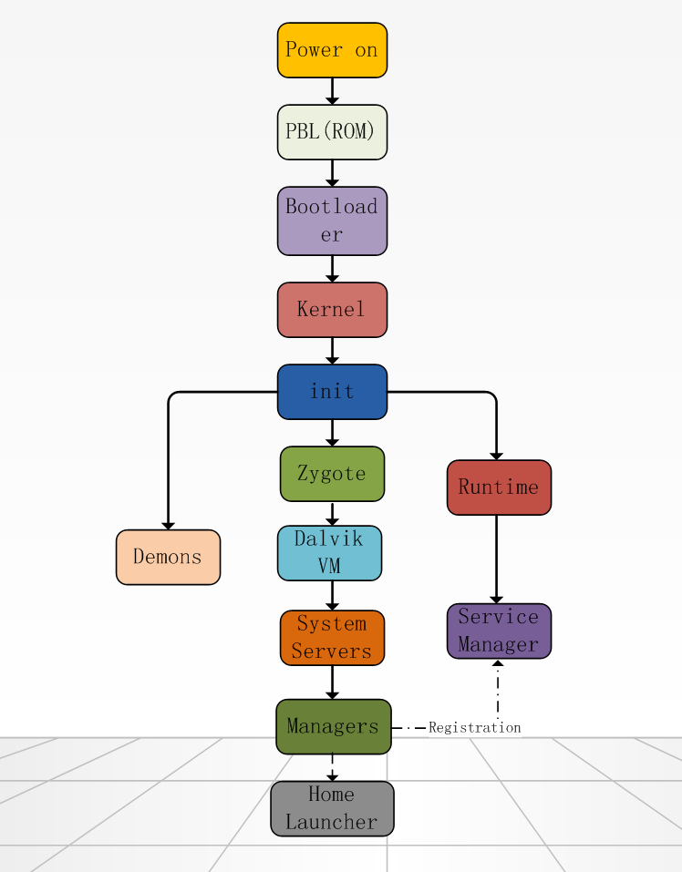

一直比较好奇，当我们拿起手机，按下电源键的那一刻，手机里面都发生了什么事情？

先看看整个启动流程图（图片来源：[Andy.Lee's Blog](http://huaqianlee.github.io/2015/08/23/Android/%E9%AB%98%E9%80%9AAndroid%E8%AE%BE%E5%A4%87%E5%90%AF%E5%8A%A8%E6%B5%81%E7%A8%8B%E5%88%86%E6%9E%90-%E4%BB%8Epower-on%E4%B8%8A%E7%94%B5%E5%88%B0Home-Lanucher%E5%90%AF%E5%8A%A8/) ）

下面是针对这一问题，提出的一些子问题：

CPU可以直接读取并执行ROM中的程序吗？

ROM中的程序做了什么事情？

启动设备是什么？

如何搜索到启动设备？

启动设备中的BootLoader做了什么？

启动设备的分区是什么？如何查看？

Android unlock BootLoader是什么意思？解锁和锁定有什么区别？

Android刷机包中的各个文件是干什么的？对应手机的存储设备或者分区是什么？

BootLoader是如何找到内核的？

内核初始化流程是什么？

启动的第一个进程是什么？

init进程干什么事？

init.rc脚本是什么？有什么作用？如何定制？

如何理解Linux的文件系统？

Mount设备是什么意思？如何将一个设备mount到挂载点？挂载点是如何创建的，挂载后，原来的目录内容是否还存在？

init进程启动了哪些子进程？分别有什么作用？

zygote的启动过程是怎样的？

zygote是如何fork子进程的？

SystemServer进程是如何启动的？启动了哪些服务？各有什么作用？

按下手机上的电源键后，CPU从一个固定地址开始执行代码，这是系统启动后第一段被执行的代码，由芯片厂商负责开发，存储在ROM中，专业人员把这段代码叫做PBL（Prime Boot Loader 初始引导程序），你也许会问CPU是如何读取到这段代码的，答案是总线控制器将ROM映射到内存地址，CPU直接从这段内存地址取数据并执行。那么PBL的功能是什么呢？它的功能就是上电自检并从启动设备加载执行SBL（Second Boot Loader 第二引导程序）。为什么要执行上电自检呢？设备是由CPU、内存、总线、存储设备和各种控制器等组件组成，这些组成部件的型号、配置参数各不相同，上电自检就是为了搞清楚他们的信息，把他们设置成合适的状态，并协调他们工作。好了，你可能还会有一个疑问，为什么需要SBL，PBL不能把所有的事情都做了吗？是这样的，由于相同型号的芯片，会和不同的组件组合在一起工作，但芯片厂商不可能事先知道组件的型号，所以PBL并不确定将来和他配合的组件是什么，因此PBL只会检查最芯片内集成的基本组件，剩下的交给功能SBL完成。

SBL是设备厂商负责开发的，设备厂商围绕芯片，添加一些其他组件，通过SBL初始化这些组件。SBL存储在启动设备中。启动设备就是手机上的Flash存储设备，我们常说的手机配置像运存4GB、内存64GB，Flash存储设备指的就是这64GB内存。

SBL做一些更高级的初始化工作后，转到更为灵活和通用的BootLoader程序运行，这个通用的BootLoader会从启动设备中找到kernel镜像文件，加载并执行kernel。BootLoader还有一项功能就是当检测到电源键和音量减按键同时按下时，进入Fastboot模式。

##### 参考链接

> [Android启动过程深入解析](http://blog.jobbole.com/67931/)
>
> [高通Android设备启动流程分析(从power-on上电到Home Lanucher启动)](http://huaqianlee.github.io/2015/08/23/Android/%E9%AB%98%E9%80%9AAndroid%E8%AE%BE%E5%A4%87%E5%90%AF%E5%8A%A8%E6%B5%81%E7%A8%8B%E5%88%86%E6%9E%90-%E4%BB%8Epower-on%E4%B8%8A%E7%94%B5%E5%88%B0Home-Lanucher%E5%90%AF%E5%8A%A8/)
>
> [Android Bootloader分析](http://www.tuicool.com/articles/M7v6nuN)
>
> [救黑砖原理以及如何模拟一块黑砖](http://www.oneplusbbs.com/thread-673966-1-1.html)
>
> [高通msm8994启动流程简介](http://blog.csdn.net/finewind/article/details/46469645)
>
> [Android系统典型bootloader分析](https://security.tencent.com/index.php/blog/msg/38)
>
> [android系统的分区结构](http://blog.csdn.net/anseven/article/details/38780205)
>
> [From PowerOn to Android – The Boot Sequence](https://javigon.com/2012/08/24/from-poweron-to-android-the-boot-sequence/)
>
> [Android Boot Sequence](http://learnlinuxconcepts.blogspot.com/2014/02/android-boot-sequence.html)
>
> [Android gingerbread eMMC booting](http://processors.wiki.ti.com/index.php/Android_gingerbread_eMMC_booting)